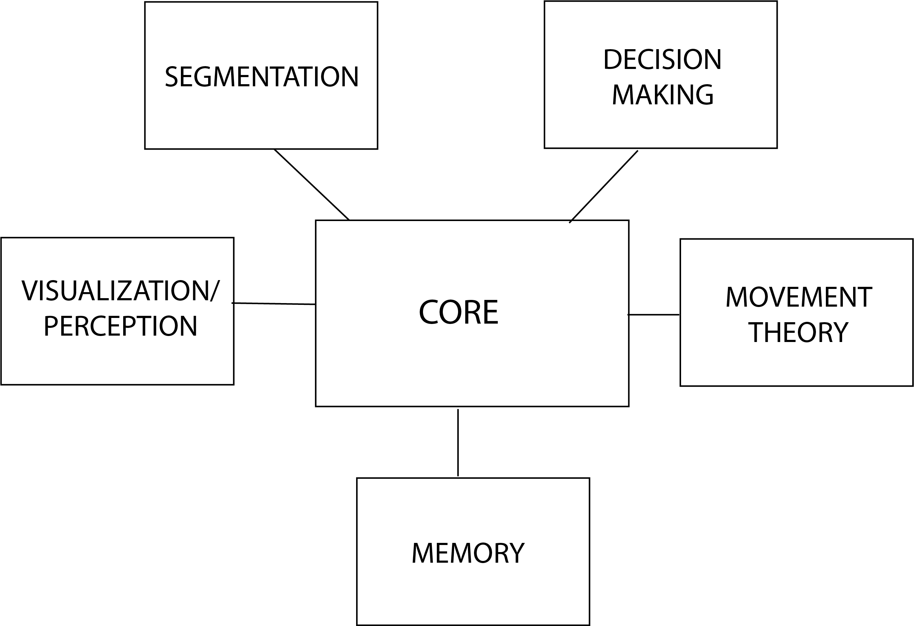

# LuminAI Overview 
The project is divided into five separate modules: Core, Visualization-Perception, Segmentation, Movement Theory, and Decision Making

## Core:
- This module is the only one required. 
- This module is unique as its the only one that includes dependencies on the other modules
- In other words, this module “knows” about all the other modules
- The rest of the modules only "know” about themselves and the core module
- This allows the project to be very easily changeable on an entire module level - you only need to modify the core module when switching modules out

### MainDriver.cs:
- The main class that controls the entire project.
- This class is the game manager, and it handles communication between all of the modules
- NOTE: this is the class you want to edit when replacing other modules

### BodyFrame.cs
- The class we use to represent a skeleton pose at an instance of time 
- Represents the skeleton as a collection of joints (quaternions)

### Gesture.cs
- A collection of many body frames ordered by time

## Visualization + Perception:
- This double module is responsible for two things:
    1. Taking in input from the user using the Kinect and converting it into Core.BodyFrame form
    2. Updating the virtual avatar to display the movement we desire
- NOTE: this module is based on the “Kinect v2 Examples with MS-SDK and Nuitrack SDK” asset bundle by RF Solutions with a significant amount of augmentation done by us.
https://assetstore.unity.com/packages/3d/characters/kinect-v2-examples-with-ms-sdk-and-nuitrack-sdk-18708
Most of the changes we made are located in AvatarController.cs

### KinectManager.cs
- Handles the communication between Unity and the Kinect
- Handles managing all active Avatar Controllers in the scene

### AvatarController.cs
- Handles moving the virtual dancer model based on kinect input
- Attaches to the virtual dancer model in the scene
- This is the most important class in the entire module
- Two methods to note:
    - Public BodyFrame currentBodyFrame: updates every frame with the most current pose of the user skeleton
    - Public BodyFrame otherSource: will use this body frame instead of the kinect feed to pose the virtual dancer if useOtherSourceForMovement == true
- NOTE: we are using a dummy camera to align the virtual dancer to where the kinect is in real life
public Camera posRelativeToCamera

# Gesture Segmentation
- Handles generating gesture object based on a live feed of body frames it receives from mainDriver

### SegmentationManager.cs
- Handles communication with the main driver, as well as the individual GestureSegmenters

### GestureSegmenter.cs
- Abstract class that all variants of segmenters extend and implement

### NewStillnessSegmenter.cs
- Using information from the segmentation manager, this class generates and sends back a gesture based on the stillness of the user
- When a user’s  “energy” goes over a threshold it will create a new gesture object and begin populating it with body frames as long as the user keeps moving
- When the user’s “energy” drops below a threshold, it will cut the gesture and return it to the gesture manager

### RhythmSegmenter.cs
- NOTE: this is heavily based on the rhythm segmenter from the original ViewpointsAI project
- Keeps a list of 4 rhythm trackers for each joint (we are observing 15 joints)
- The rhythm trackers wait for a moment when the direction of an axis changes (example: the end of the motion of a wave)
- Rhythm tracker marks the point in time where the change in direction occurred, and waits for a second change of direction
- Once it detects a second change of direction it makes the second point in time, and creates a period from the two points in time
- As long as the rhythm tracker detects changes of direction at repeating periods, it will return to the rhythm segmenter that there is rhythm
- The rhythm segmenter will collect and generate the gesture as long as there is at least one rhythm tracker that is reporting that there is rhythm  
- Since the rhythm tracker will continue to report that there is rhythm for a period’s length of time after the user has stopped moving, the rhythm segmenter will cut out the last period’s length worth of body frames from the gesture before returning it to the segmentation manager

## Movement Theory:
- Handles transformations of a gesture as its being played and handles calculating the predicates for a gesture as its being recorded.
- Changes individual body frame objects

### Transformations.cs
- Static class
- Holds all the math for transforming gestures

### PredicateMath.cs
- Static class
- Updates the lists of tempo, energy and size in the gesture object

## Decision Making:
- Handles all decision making that the agent does, including choosing between response modes.

### DecisionManager.cs
Handles decision making for the agent.

